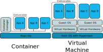

```{r setup, include=FALSE}
knitr::opts_chunk$set(echo = FALSE)
```

## Content

>- What is Docker
>- How can Docker be useful to R users
>- How Docker is working, how to use it
>- Examples
>- Docker Best Practices

# What is Docker

## What is a container
<center>*A standardized unit of software*
<p class=cite>
[Docker Website](https://www.docker.com/resources/what-container)
</p>
</center>
<p/>

- Containers package a piece of software 
- Containers wrap all dependencies for this software to run
- Containers are invisible to each other
- Containers can be combined to create more complex modular systems

- <center>*Containers are nice little boxes with reproducibe software inside*</center>

## Containerisation vs. Virtualisation
{width=100%}

# For Data Scientist and R users?

## Why use Docker

- Repeatability
  - Analysis
  - Environment
- Application and data packaging
- Development / Production environment management
- Deployment on well known PaaS
- Easy services deployment

# How Docker works and how to use it

## Dockerfile, images, containers...
{width=90%}

<p/>
- Dockerfile: describes an image (software, dependencies, ...)
- image: the software with all its dependencies
- container: (running) instance of an image 

## In practice

<div align="center">
*Standing on the shoulders of giants*
</div>
<p></p>
- Choose a base image (for ex. r-base)

    ````
    FROM r-base:latest
    ````
    
- Describe your customisations (add R packages, your code, ...)
    
    ````
    RUN R -e "install.packages('shiny')"
    COPY build/mypackage.tar.gz .
    ````
    
- Build the image

    ````
    $ docker build -t my-image-name .
    ````
    
- Start a container

    ````
    $ docker run my-image-name
    ````

## Persistence: bind mounts

>- Each new new container starts from the image, data are lost when the container is deleted

- Bind mounts are disk locations outside the container where data can be read or saved

    ````
    $ docker run --mount type=bind,source=/path/to/my/data,target=/data image-name
    ````
<p class=cite>[Docker Bind Mounts Documentation](https://docs.docker.com/storage/bind-mounts/)</p>

# Examples

## Running an existing image

- Install docker
<p class=cite>[Docker Install Documentation](https://docs.docker.com/install/)</p>

- Run an image

    ````
    $ docker run --rm -p 8787:8787 -e PASSWORD=GoodPassword!
      --mount type=bind,source=~/Documents/Dev/Docker4R,target=/home/rstudio/data
      rocker/tidyverse
    ````

## Shiny app

````
    FROM r-base:latest
    MAINTAINER Lynda Metref "lynda.metref@gmail.com"

    RUN R -e "install.packages('shiny')"

    COPY build/RBoilerplateShinyWithCredentials*.tar.gz .
    RUN R -e "install.packages(dir(pattern='RBoilerplateShinyWithCredentials.*'))"

    EXPOSE 8888
    ENTRYPOINT ["R", "-e", "library(RBoilerplateShinyWithCredentials);\ 
    launch(8888,'0.0.0.0')"]
````

# Docker Best Practices

## Docker security: it's like your home

- Don't let strangers in
- Only give your keys to someone you know well

## Use base images from known sources

- Docker Hub Certified Images and Verified Publisher
- Reputable communities
- Check Dockerfiles

## When running ...

- Do not run your application in the container as root (the default)

    ````
    $ docker run --user my_user ...
    ````

- Check network paramters
<p class=cite>[Docker Network Documentation](https://docs.docker.com/network/)</p>
  
## When creating your own ...

- Don't put credentials in Dockerfile, load them from environment
  https://github.com/lyndametref/RBoilerplateShinyWithCredentials

# Thanks for your attention!

## Aknowledgements

Sources:

> - https://ropenscilabs.github.io/r-docker-tutorial
> - https://docs.docker.com

Thank you to:

> - Helbling Technik Wil AG for supporting the event organisation
> - Etienne Dysli Metref for review and feedback

